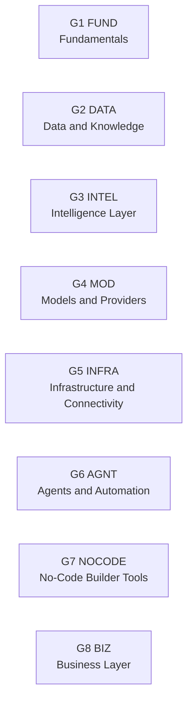

# AI Founders Periodic Flashcards Notes*

*Source credit: AI Organic Chart.*

## Source

- Video: "You're Learning AI Wrong. Here's The Cheat Sheet."
- Channel: AI Founders
- YouTube ID: `Zd8dA7bijzo`
- Public mirror/date check: https://www.heatherjones.org/youre-learning-ai-wrong-heres-the-cheat-sheet/
- Mirror publication date: April 21, 2026
- Local transcript capture: `ai_founders_transcript.txt`

## Dataset

The normalized flashcard data lives in:

- `src/data/aiCheatSheetData.js`

The transcript gives the full group and element names verbally. A frame audit of the video table was used for visible short codes where available, including G3's `ML`, `RI`, and `GD` labels.

## Group Map

## Uncertainties

- The transcript did not expose the original visual chart's exact printed abbreviations, so abbreviations were chosen conservatively from the full term names.
- Group 3 has five spoken elements. The video table visual shows a sixth G3 cell, but that cell is unlabeled/blank while the chart still says "48 elements, 8 groups." The app keeps a `TBD` card in that slot instead of inventing a transcript term.
- The WordPress transcript endpoint returned `No caption tracks found`, but `youtube-transcript-api` successfully fetched 713 snippets for the same video ID.
